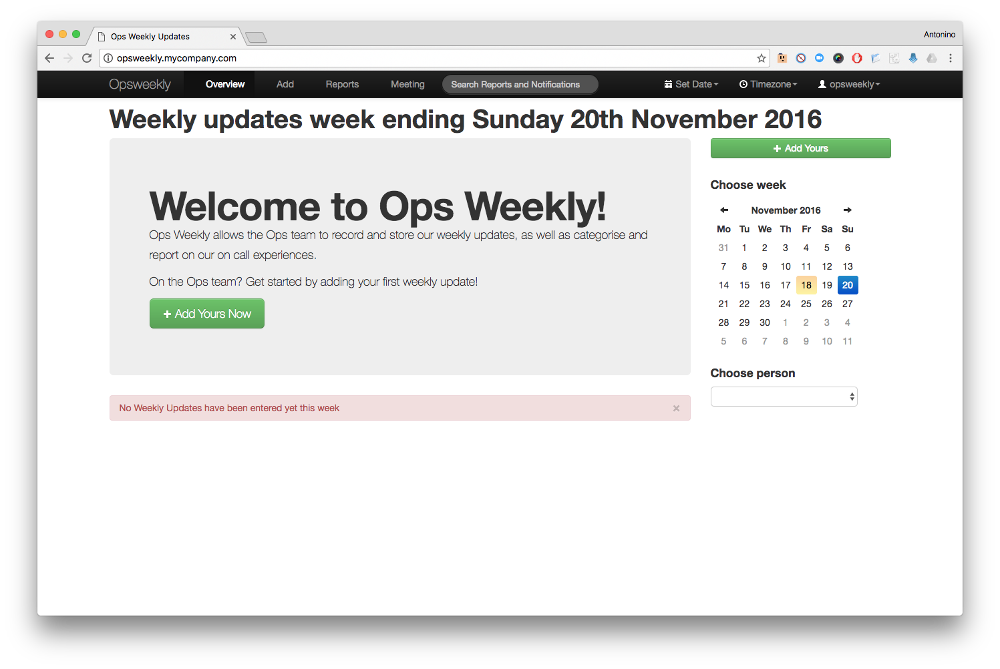

#   Opsweekly

This application is a weekly report tracker, an on call categorisation and reporting tool, a sleep tracker, a meeting organiser and a coffee maker all in one.

The goal of Opsweekly is to both organise our team into one central place, but also help us understand and improve our on call rotations through the use of a simple on call "survey", and reporting as a result of that tracking.

Opsweekly can retrieve information from Jira, GitHub, Bitbucket, Pagerduty and so on.

Opsweekly consists of two containers: one mariadb database and the application container (Apache + PHP 5).

The Opsweekly container is built from scratch starting from Alpine Linux and Opsweekly source code (https://github.com/etsy/opsweekly). 




## More info
### Please visit <https://github.com/etsy/opsweekly/blob/master/screenshots/README.md> for a guided tour of how Opsweekly works and the reports it can generate!

## Requirements
- docker
- docker-compose

## How to run it
First change the configurations in `config.php` file, then start opsweekly executing:
```
$  docker-compose up -d
```

Once done, login to opsweekly using the credentials `opsweekly:Opsw33kly!`

* Default url: <http://opsweekly.mycompany.com/>, make sure to add an entry for it in your /etc/hosts to be resolved as localhost
* NOTE: if you change the `$prod_fqdn` variable inside config.php with your domain, you need to change the team domain too.
